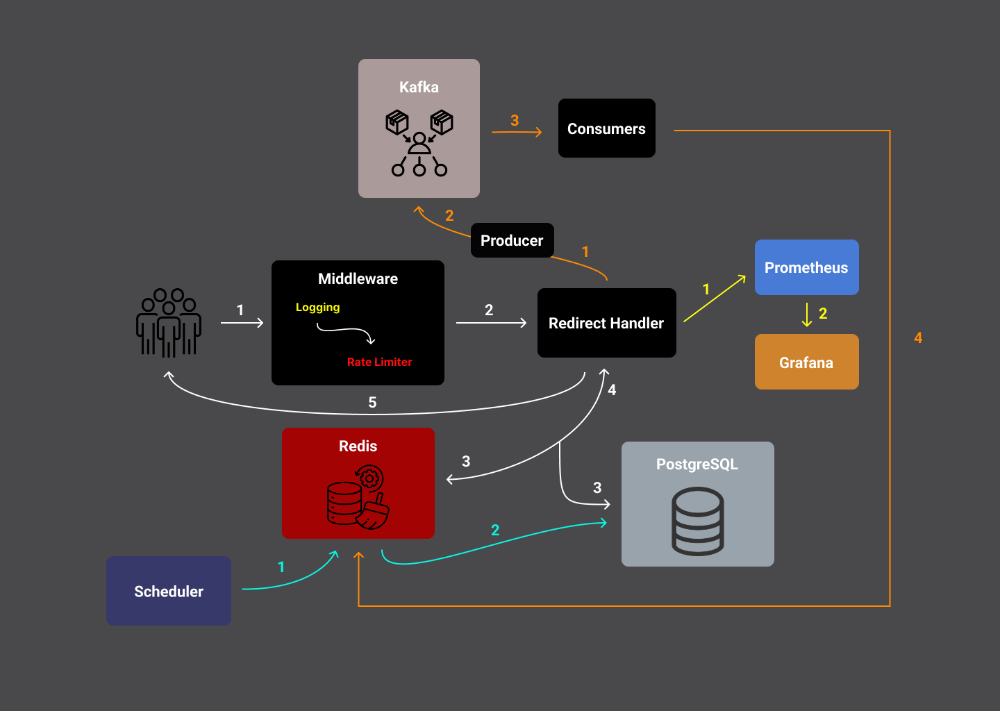

# 🚀 URL Shortener

A lightweight but scalable **Go** pet project exploring backend performance and scalability.  
It uses **Redis** for fast caching, **PostgreSQL** as the main datastore, and **Kafka** for processing click events.  
Designed to handle high throughput, it’s been tested with **bombardier** (up to millions of requests) to explore concurrency, rate limiting, and real-world latency under load.  
Metrics are exposed through **Prometheus** and visualized with **Grafana**.

---

### 🧩 Architecture Overview

   
  <em>System flow: middleware, caching, event streaming, and observability</em>

---

### ⚙️ Key Components
- 🧠 **Middleware:** Handles logging, rate limiting, and validation.  
- 🔗 **Redirect Handler:** Validates slugs, checks cache, and redirects requests.  
- ⚡ **Redis:** Caches active URLs and metrics for low latency.  
- 🗃️ **PostgreSQL:** Persistent storage and source of truth.  
- 📬 **Kafka:** Manages click event streaming and background flushing.  
- 📊 **Prometheus & Grafana:** Observability and performance metrics.  
- ⏱️ **Scheduler:** Periodic jobs for cleanup and metric aggregation.

---

### 🧠 Highlights
- 🧨 Tested with **tens of thousands to 1M+ requests** using **bombardier**  
- 🧵 Explores **concurrency**, **rate limiting**, and **load handling** in Go  
- 🧩 Built as a **learning project** to understand scalable backend design  

---
